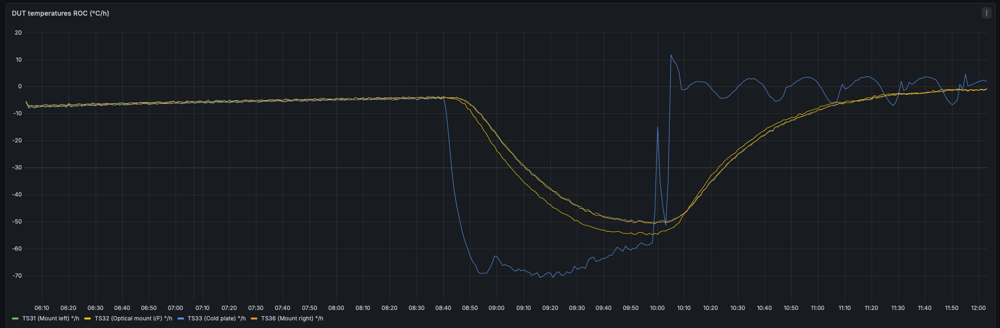

# Advanced Query: Temperature Rate of Change (°/h)

This page documents a Grafana SQL query that computes the **temperature change rate per hour** for several sensors.

The query takes raw temperature samples, aggregates them in 1-minute buckets, then computes the slope between consecutive buckets:

- `TS31 (Mount left)`
- `TS32 (Optical mount I/F)`
- `TS33 (Cold plate)`
- `TS36 (Mount right)`

## Full Query

```sql
SELECT
	bucket,
	(AVG("ts31") - LAG(AVG("ts31")) OVER (ORDER BY bucket))
		/ ((CAST(bucket AS BIGINT) - CAST(LAG(bucket) OVER (ORDER BY bucket) AS BIGINT)) / 3600000000000.0)
		AS "TS31 (Mount left) °/h",
	(AVG("ts32") - LAG(AVG("ts32")) OVER (ORDER BY bucket))
		/ ((CAST(bucket AS BIGINT) - CAST(LAG(bucket) OVER (ORDER BY bucket) AS BIGINT)) / 3600000000000.0)
		AS "TS32 (Optical mount I/F) °/h",
	(AVG("ts33") - LAG(AVG("ts33")) OVER (ORDER BY bucket))
		/ ((CAST(bucket AS BIGINT) - CAST(LAG(bucket) OVER (ORDER BY bucket) AS BIGINT)) / 3600000000000.0)
		AS "TS33 (Cold plate) °/h",
	(AVG("ts36") - LAG(AVG("ts36")) OVER (ORDER BY bucket))
		/ ((CAST(bucket AS BIGINT) - CAST(LAG(bucket) OVER (ORDER BY bucket) AS BIGINT)) / 3600000000000.0)
		AS "TS36 (Mount right) °/h"
FROM (
	SELECT
		DATE_BIN(INTERVAL '1 minute', "time", TIMESTAMP '1970-01-01T00:00:00Z') AS bucket,
		"ts31", "ts32", "ts33", "ts36"
	FROM "dt8874"
	WHERE "time" >= $__timeFrom AND "time" <= $__timeTo
)
GROUP BY bucket
ORDER BY bucket
```

## What This Query Does

1. Filters rows to the Grafana-selected time range using `$__timeFrom` and `$__timeTo`.
2. Assigns each data point to a 1-minute time bucket with `DATE_BIN`.
3. Computes per-bucket average temperature for each sensor with `AVG(...)`.
4. Uses `LAG(...) OVER (ORDER BY bucket)` to read the previous bucket value.
5. Divides temperature difference by time difference (in hours) to get rate in `°/h`.

## Query Breakdown

### 1) Inner Query: Bucket Alignment

```sql
SELECT
	DATE_BIN(INTERVAL '1 minute', "time", TIMESTAMP '1970-01-01T00:00:00Z') AS bucket,
	"ts31", "ts32", "ts33", "ts36"
FROM "dt8874"
WHERE "time" >= $__timeFrom AND "time" <= $__timeTo
```

The basic structure of this inner query is — fetch data from your measurement `dt8874` within the selected time range.

```sql
SELECT ... FROM "dt8874" WHERE ...
```

Where:

- `"ts31", "ts32", "ts33", "ts36"` fetches the raw values of your four sensors. No transformation yet — just the raw readings.
- All ~1-second samples get grouped into 1-minute buckets. `DATE_BIN(INTERVAL '1 minute', ...)` snaps each timestamp to the start of its 1-minute interval, basically rounding the timestamps to the lower 1-minute boundary.
- The fixed origin `1970-01-01T00:00:00Z` ensures stable and predictable bucket boundaries.
- Filtering is driven by Grafana dashboard time controls.

So, instead of one row per second, you get many rows all sharing the same bucket timestamp — ready for the outer query to average them with AVG(). That's what reduces the noise before computing the derivative.

### 2) Outer Query: Bucket Aggregation

```sql
GROUP BY bucket
ORDER BY bucket
```

- `GROUP BY bucket` aggregates all samples in the same minute.
- `ORDER BY bucket` is required so window functions process rows chronologically.

### 3) Rate Computation Using Window Functions

The `AVG("ts31")` takes all the raw 1-second samples that fell into the same 1-minute bucket and averages them into one smooth value per bucket. This is what kills the noise.

In `LAG(AVG("ts31")) OVER (ORDER BY bucket)`, `LAG()` means "**the value from the previous row**". So if you're looking at the 14:10 bucket, LAG gives you the averaged value from the 14:09 bucket.

For each sensor, the query computes:

$$
\operatorname{rate}(t) = \frac{\overline{T}(t) - \overline{T}(t-1)}{\Delta t_{\text{hours}}}
$$

Where:

- $\overline{T}(t)$ is the average temperature in the current bucket.
- $\overline{T}(t-1)$ is the average temperature in the previous bucket.
- $\Delta t_{\text{hours}}$ is the exact elapsed time between the current and previous bucket.

In SQL terms:

- Numerator: `AVG("tsXX") - LAG(AVG("tsXX")) OVER (ORDER BY bucket)`
- Denominator: `(CAST(bucket AS BIGINT) - CAST(LAG(bucket) OVER (ORDER BY bucket) AS BIGINT)) / 3600000000000.0`

The denominator converts timestamp delta to hours:

- `CAST(... AS BIGINT)` gives epoch time in nanoseconds.
- `3600000000000.0 = 3.6e12` nanoseconds/hour.

So the final unit is:

$$
\frac{\text{degrees}}{\text{hour}} = \text{°/h}
$$

## Interpreting the Output

- Positive value: the sensor is warming up.
- Negative value: the sensor is cooling down.
- Near zero: thermal steady state.

The first row has no previous bucket, so `LAG(...)` returns `NULL` and the corresponding rate is `NULL`.

## Resulting Timeseries Plot



This Grafana panel shows the computed rate-of-change series in °/h for TS31, TS32, TS33, and TS36 over the selected dashboard interval. The traces make warming and cooling phases immediately visible, with values near zero indicating thermal stabilization.

!!! info "To summarize"
    The final number that is in the plot: **how many degrees per hour was this sensor changing during that 1-minute window?**

## Notes and Caveats

- If a bucket has no data, behavior depends on data continuity and database engine semantics; gaps may produce larger effective `Δt` values at the next available point.
- Bucket averaging reduces short-term measurement noise. A 1-minute bucket gives responsive trends. For smoother curves, increase the bin size (for example 5 minutes).
- Keep all sensors in the same query for synchronized comparison on one panel.
