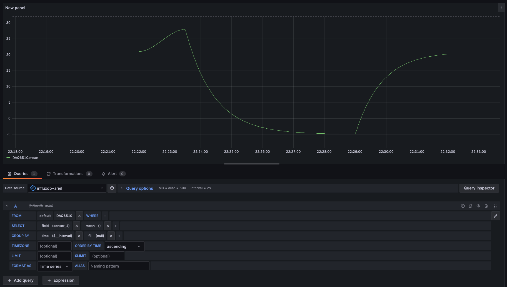

# Using Grafana

Grafana is commonly used with CGSE to visualize telemetry data stored in
InfluxDB or QuestDB.

This page focuses on day-to-day usage: connecting Grafana to a supported backend,
creating dashboards, and understanding the data you are plotting.

For stack installation and server configuration, see
[Monitoring Stack Setup](../admin_guide/monitoring.md).

For developer details on telemetry data structure, see
[Monitoring and Telemetry in CGSE](../dev_guide/monitoring.md).

---

## Connect Grafana to a Metrics Backend

After your metrics backend and Grafana are running, open Grafana in your browser:
`http://localhost:3000`.

=== "InfluxDB"

    In the left menu, select Connections and add a new InfluxDB connection.

    Use the following settings:

    - `Name`: Any descriptive name, for example `influxdb3-ariel`.
    - `Query language`: `SQL`.
    - `HTTP` > `URL`: `http://127.0.0.1:8181`.
    - `Auth`: Enable only Basic auth.
    - `InfluxDB Details` > `Database`: The target InfluxDB database.
    - `InfluxDB Details` > `Token`: Your InfluxDB token (starts with `apiv3_`).
    - `InfluxDB Details`: Enable Insecure Connection.

=== "QuestDB"

    In the left menu, select Connections and add a new PostgreSQL connection
    (QuestDB is exposed via PostgreSQL wire protocol).

    Use the following settings:

    - `Name`: Any descriptive name, for example `questdb-ariel`.
    - `Host URL`: `127.0.0.1:8812`.
    - `Database`: `qdb` (or your configured `CGSE_QUESTDB_DATABASE`).
    - `Username`: `admin` (or your configured `CGSE_QUESTDB_USER`).
    - `Password`: `quest` (or your configured `CGSE_QUESTDB_PASSWORD`).
    - `TLS/SSL Mode`: `disable` unless you configured TLS.

Click Save and test to verify that Grafana can reach the database.

If the connection test fails, first verify the host, credentials, and database settings.

---

## Create a Basic Dashboard

=== "InfluxDB"

    1. Open Dashboards in the left menu.
    2. Create a new dashboard and add a panel.
    3. In the panel query, select your InfluxDB data source.
    4. Select the table that matches the process storage mnemonic.
    5. Select the metrics you want to plot.
    6. Add `time` in Data Operations so Grafana recognizes the timestamp column.

=== "QuestDB"

    1. Open Dashboards in the left menu.
    2. Create a new dashboard and add a panel.
    3. In the panel query, select your PostgreSQL (QuestDB) data source.
    4. Build a SQL query for the target table (for example, `SELECT time, temperature FROM "daq6510" ORDER BY time`).
    5. Ensure the query returns a `time` column and one or more numeric value columns.
    6. Set panel visualization options as needed (time-series panel works best for telemetry).

In CGSE, the table name usually matches the storage mnemonic of the process
that produced the telemetry.

Example of the query configuration:

---

## Troubleshooting Basics

- No data visible: verify the selected database and table name.
- Empty graph: verify that `time` is included in the query operations.
- Auth errors: verify token/credentials and data source settings.
- Unexpected table names: check the process storage mnemonic used by the
   corresponding CGSE component.
